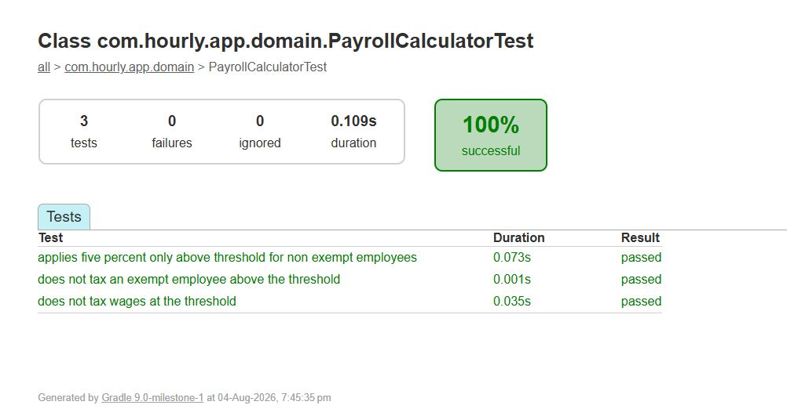

# WeSure Payroll Assessment

An offline-first Android payroll prototype built with Kotlin and Jetpack Compose.

The app supports creating, reviewing, editing, and deleting payrolls. Payroll data is stored locally with Room, and pending changes are kept in a persistent outbox for synchronization retries.

## Features

- Create a payroll with multiple employees.
- Review gross wages, tax, and net pay before saving.
- Edit an existing payroll.
- Delete a payroll with confirmation.
- Persist payrolls across app restarts.
- Retain local changes when synchronization fails.
- Retry pending operations manually or through WorkManager.
- Record payroll lifecycle events with Firebase Analytics.
- Report unexpected local-write failures through Crashlytics.

## Business rule

An employee pays 5% tax when:

- Wages are greater than `$1,000`.
- The employee is not tax-exempt.

Exactly `$1,000` is not taxed.

For the assessment example:

| Employee | Wages | Exempt | Tax |
|---|---:|:---:|---:|
| Rakesh | $900.00 | No | $0.00 |
| John | $1,900.00 | Yes | $0.00 |
| Richard | $2,000.00 | No | $100.00 |

Money is represented with `BigDecimal` through the `Money` value type to avoid floating-point rounding errors.

## Application flow

```text
Payroll list
    -> Create or open payroll
    -> Add/edit employees
    -> Review calculated totals
    -> Save locally and attempt sync
    -> View payroll details
    -> Edit or delete
```

Room is the source of truth. The UI observes Room through `Flow`, so creating, updating, or deleting a payroll automatically updates the Compose screens.

## Architecture

```text
Compose UI
    -> PayrollViewModel
    -> Use cases
    -> PayrollRepository
    -> DefaultPayrollRepository
       -> Room
       -> PayrollApi
```

The project is organized by feature and layer:

| Package | Responsibility |
|---|---|
| `domain/model` | Payroll, employee, and money models |
| `domain` | Tax calculation and repository contract |
| `domain/usecase` | Application actions used by the ViewModel |
| `data/local` | Room entities, DAO, transactions, and migrations |
| `data` | Repository and API implementations |
| `presentation` | ViewModel state, commands, errors, and analytics |
| `ui` | Compose screens and navigation |
| `sync` | WorkManager retry worker |
| `di` | Hilt bindings and providers |

The domain layer has no Android framework dependency. Hilt binds `PayrollRepository` to `DefaultPayrollRepository` and `PayrollApi` to `InMemoryPayrollApi`.

More detail is available in [ARCHITECTURE.md](ARCHITECTURE.md).

## Offline-first writes

Creating or updating a payroll performs one Room transaction:

```text
Save payroll and employees
    -> enqueue UPSERT operation
    -> commit locally
    -> attempt API sync
```

Deleting follows the same approach with a `DELETE` operation. Employee rows are removed through a cascading foreign key.

Repository writes distinguish between:

- A successful local write that also synchronized.
- A successful local write that is waiting for synchronization.
- A local database failure.

Pending operations are retried:

- Immediately after a local write.
- Through the Sync action.
- By a unique periodic WorkManager request with a network constraint and exponential backoff.

## API choice

`InMemoryPayrollApi` is used because the assessment does not include a backend. It implements the same `PayrollApi` interface that a future Retrofit implementation could use.

The mock API lasts only for the current application process. Room remains responsible for local persistence.

## Main libraries

- Jetpack Compose and Material 3
- Navigation Compose
- Lifecycle ViewModel, Flow, and StateFlow
- Room
- WorkManager
- Hilt
- Firebase Analytics and Crashlytics
- JUnit 4 and AndroidX Compose UI Test

Dependency versions are defined in `gradle/libs.versions.toml`.

## Tests

| Test | Type | Coverage |
|---|---|---|
| `PayrollCalculatorTest` | Local JVM unit test | Tax threshold, exemption, total tax, and net pay |
| `DefaultPayrollRepositoryTest` | Instrumented Room integration test | Create/read, update, and delete persistence |
| `PayrollUiTest` | Instrumented Compose UI test | Create, review, edit, and delete workflow |

The instrumented tests use an in-memory Room database, so they do not depend on existing device data.

Run local unit tests:

```powershell
.\gradlew.bat testDebugUnitTest
```

Run instrumented tests on a connected device or emulator:

```powershell
.\gradlew.bat connectedDebugAndroidTest
```

Run Android lint:

```powershell
.\gradlew.bat lintDebug
```

### Verification reports

The following saved reports provide a reviewable snapshot of the checks run for this assessment:

| Check | Scope | Saved result |
|---|---|---|
| Android lint | Static analysis of the debug build | [Open lint report](docs/test-results/lint-debug.html) |
| `PayrollCalculatorTest` | Local JVM business-rule tests | [View result](docs/test-results/payroll-calculator-test.jpg) |
| `DefaultPayrollRepositoryTest` | Instrumented Room repository tests | [Open test report](docs/test-results/default-payroll-repository-test.html) |
| `PayrollUiTest` | Instrumented end-to-end Compose workflow | [Open test report](docs/test-results/payroll-ui-test.html) |

#### Payroll calculator unit-test result



These files are retained as evidence from a specific run. The Gradle commands above remain the source of truth and can be used to reproduce the checks in the current environment.

> **Viewing HTML reports:** GitHub displays committed HTML files as source code. Download an HTML report using its **Download raw file** button, then open the downloaded file in a web browser. The JPG result can be viewed directly on GitHub.

## Run the app

1. Open the project in Android Studio.
2. Allow Gradle sync to complete.
3. Select a device or emulator running API 24 or newer.
4. Run the `app` configuration.

The project compiles against API 36 and uses JDK 21.

Firebase configuration is intentionally not committed. To enable Analytics and Crashlytics, register an Android app with package name `com.hourly.app` in Firebase and place the downloaded configuration at `app/google-services.json`.

## Release build

Release builds enable R8 optimization and obfuscation, resource shrinking, disabled debugging, and Crashlytics-compatible line mappings.

```powershell
.\gradlew.bat assembleRelease
```

The APK is generated under `app/build/outputs/apk/release/`.

## Current limitations

- The API is an in-memory mock, not a real remote service.
- Manual synchronization does not currently show loading or success feedback.
- Production synchronization should serialize outbox replay and use idempotent server operations.
- A production payroll application would require authenticated APIs, server-side authorization, and an explicit policy for sensitive local data and backups.
